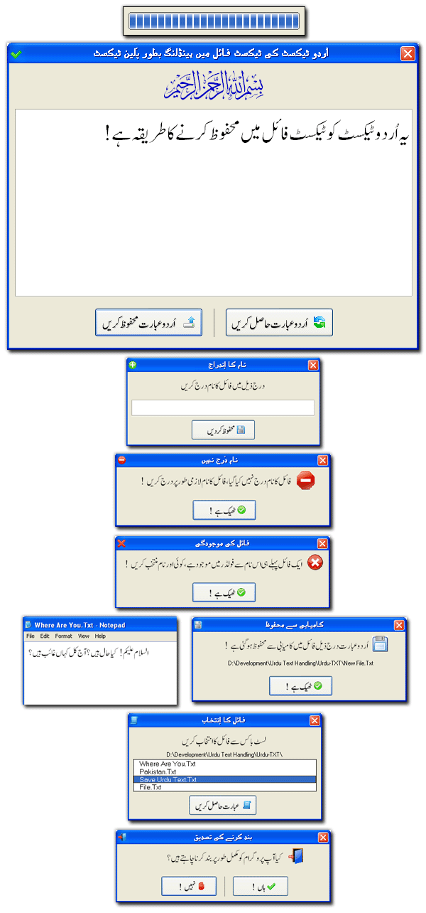



## Urdu Text Handling as Plane Text with Text \(\*\.Txt\)  Files

### Description

Pre-Requirements : Pak Urdu Installer Or East Asian Language Support (XP)

 http://www.mbilalm.com/download/ 

 Introducing Solution for the Urdu Text Handling As Plane Text in Text(*.Txt) Files with File System Objects (FSO). It was not easy but you 'll be amazed to know that it is very easy to make urdu text file that contain Urdu as plane text. The thing that needed is that right way to do that. Now, i wants to say that, much more solutions for Urdu Programming are available but in random form. We only have to get togather them for our use. In this project a new look for Urdu Softwares introducing. And much more changes made in previous methods of Urdu Programming. The main update is a common module for 'Urdu Phonetic Keyboard Layout' that makes more easy way for Urdu Textboxes. You don'thave to need for a long code lines like previous, now you 'll only put two lines in code window of Textbox & the Textbox will automatically recognize Urdu with Phonetic Keyboard Layout. I was trying to make this module from the start but was not succeded, but now its been sucessfully made. You can save Urdu in Text (*.Txt) files & use them for any perpose. In previous, control's captions was got from Database files but now a new method is used by using Plane Text(*.Txt) file as Caption's container. And this methode is much more efficient. Urdu message box dialogs introducing with no-Urdu-Jpg. New professional looking command buttons that recognize not only Urdu, but with also icons & new alignments methods. A professional looking loading progress bar also added to show loading progress. Not only this, there are much more new Functions & Methods introducing for Urdu Programming that can't be found at anywhere. Please give me Feedback on this project & tell me about your suggestions, you think that may useful. Thank You.  

 Join Urdu Programming at Facebook 

 http://www.facebook.com/pages/Urdu-Programming-VB6/263338567072301 
 
### More Info
 

             |
---                |---
**Submitted On**   |2011-06-22 15:41:26
**By**             |[Mehmood Iqbal](https://github.com/Planet-Source-Code/PSCIndex/blob/master/ByAuthor/mehmood-iqbal.md)
**Level**          |Advanced
**User Rating**    |5.0 (10 globes from 2 users)
**Compatibility**  |VB 6\.0
**Category**       |[Files/ File Controls/ Input/ Output](https://github.com/Planet-Source-Code/PSCIndex/blob/master/ByCategory/files-file-controls-input-output__1-3.md)
**World**          |[Visual Basic](https://github.com/Planet-Source-Code/PSCIndex/blob/master/ByWorld/visual-basic.md)
**Archive File**   |[Urdu\_Text\_2206796222011\.zip](https://github.com/Planet-Source-Code/mehmood-iqbal-urdu-text-handling-as-plane-text-with-text-txt-files__1-73969/archive/master.zip)

